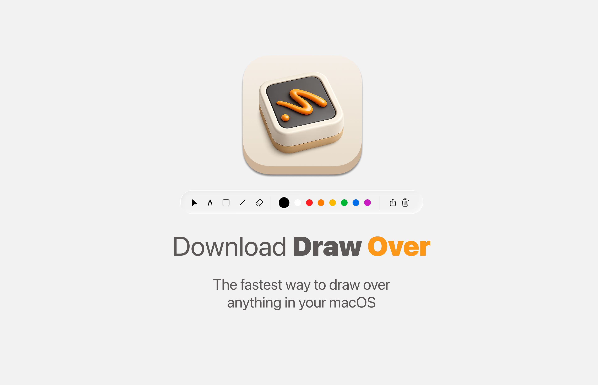

# DrawOver

> Annotate, sketch and present — right on your screen.

DrawOver is a free, native macOS drawing overlay app. It sits on top of every window, letting you draw, annotate and highlight anything on your screen — perfect for presentations, tutorials, and walkthroughs.


## Features

- ✏️ **Freehand drawing** — natural pencil tool
- ⬜ **Rectangle** — draw boxes to highlight areas
- ⭕ **Circle** — draw ellipses and circles
- ➖ **Straight line** — precise line tool
- 🧽 **Smart eraser** — erases any shape intelligently
- 🎨 **8 colors** — black, white, red, orange, yellow, green, blue, purple
- 🪟 **Liquid Glass** — native macOS 26 design
- ⌨️ **Global shortcut** — `Cmd + Shift + S` to show/hide
- 🖥️ **Menubar app** — lives quietly in your menubar
- 🚫 **No ads. No telemetry. No accounts.**

## Requirements

- macOS 26 or later
- Apple Silicon or Intel

## Installation

1. Download the latest release from [GitHub Releases](https://github.com/arturoreysoto/DrawOver/releases)
2. Move `DrawOver.app` to your Applications folder
3. Open it — it will appear in your menubar

Or build from source:

```bash
git clone https://github.com/arturoreysoto/DrawOver.git
cd DrawOver
open DrawOver.xcodeproj
```

## Usage

- Launch DrawOver from your menubar
- Press `Cmd + Shift + S` to show or hide the toolbar
- Select a tool and draw over any window
- Press the cursor icon to interact with apps underneath
- Press the trash icon to clear all drawings

## Built with

- Swift & SwiftUI
- AppKit
- macOS 26 Liquid Glass

## License

MIT — free forever, yours to inspect.

---

Made with love for macOS by [MagicApps Labs](https://magicappslab.app)
